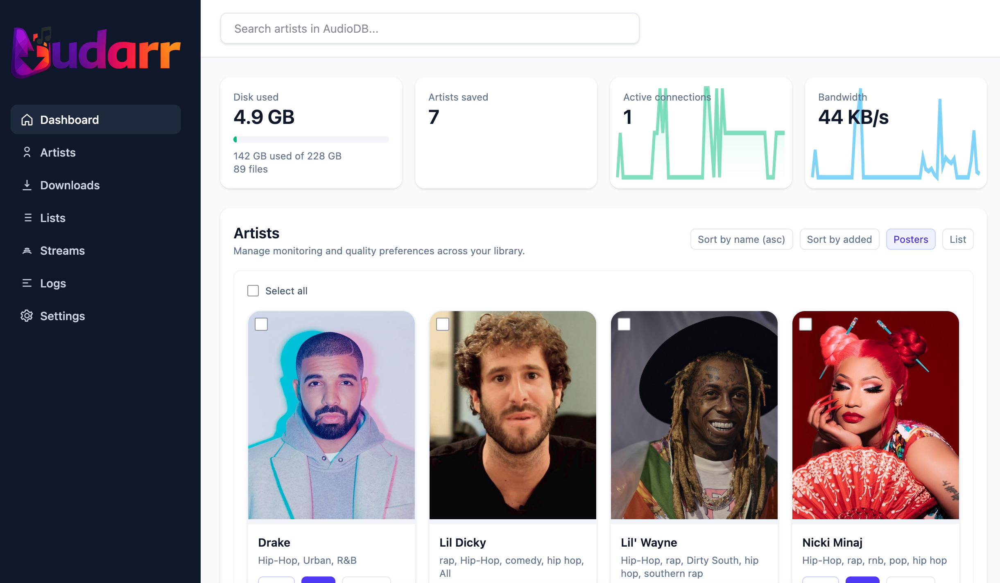
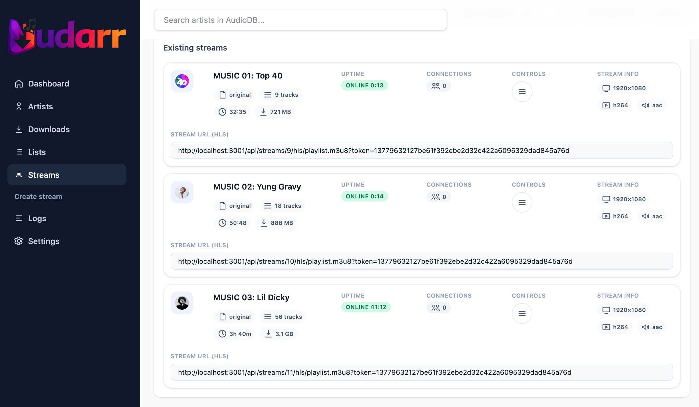
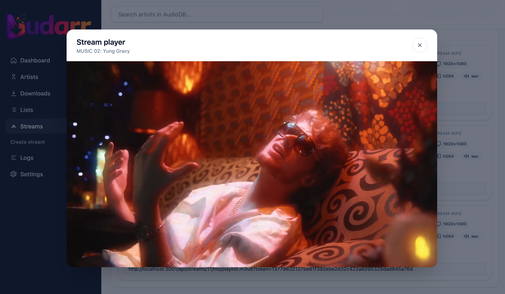

# Mudarr

Self-hosted music video automation inspired by Sonarr/Radarr.

## UI examples

### Dashboard



### Streams



### Player



## Architecture

- `apps/web` (port `3000`): web UI
- `apps/server` (port `3001`): REST API, streaming, metadata
- `apps/worker` (no port): background downloads and processing
- `postgres` (port `5432`): data store
- `redis` (port `6379`): queue/backplane

## Requirements

Any Docker environment works. For Ubuntu 20.04:

1. Install Docker and the Compose plugin:
   ```bash
   sudo apt update
   sudo apt install -y ca-certificates curl gnupg lsb-release
   sudo install -m 0755 -d /etc/apt/keyrings
   curl -fsSL https://download.docker.com/linux/ubuntu/gpg | sudo gpg --dearmor -o /etc/apt/keyrings/docker.gpg
   sudo chmod a+r /etc/apt/keyrings/docker.gpg
   echo "deb [arch=$(dpkg --print-architecture) signed-by=/etc/apt/keyrings/docker.gpg] https://download.docker.com/linux/ubuntu $(lsb_release -cs) stable" | sudo tee /etc/apt/sources.list.d/docker.list > /dev/null
   sudo apt update
   sudo apt install -y docker-ce docker-ce-cli containerd.io docker-buildx-plugin docker-compose-plugin
   ```
2. Allow your user to run Docker without sudo:
   ```bash
   sudo usermod -aG docker $USER
   newgrp docker
   ```

## Configuration

Create a `.env` file alongside your `docker-compose.yml` (repo root if you cloned it):

```bash
POSTGRES_DB=mudarr
POSTGRES_USER=mudarr
POSTGRES_PASSWORD=changeme

# Optional but recommended
MEDIA_ROOT=/data/media
API_PORT=3001
WEB_PORT=3000
REDIS_PORT=6379
POSTGRES_PORT=5432
VITE_API_URL=http://localhost:3001

# Optional: move HLS temp files onto the storage volume
HLS_TMP_DIR=/data/storage/hls

# Optional integrations
PLEX_ENABLED=false
SPOTIFY_ENABLED=false
LASTFM_ENABLED=false
LASTFM_API_KEY=
AUDIODB_API_KEY=

# Optional downloader controls
WORKER_CONCURRENCY=
YT_DLP_OUTPUT_FORMAT=mp4-remux
YT_DLP_COOKIES=
YT_DLP_COOKIES_FROM_BROWSER=
```

### Web API base URL

The web UI defaults to `http://localhost:3001`. If you change `API_PORT`, set `VITE_API_URL`
to the same host/port. The web container reads `VITE_API_URL` at startup (no rebuild required).

1. Create `apps/web/.env` (for local builds):
   ```bash
   VITE_API_URL=http://localhost:3001
   ```
2. Restart the web container:
   ```bash
   docker compose up -d web
   ```

## Storage volumes

The compose file mounts two host paths:

- `./media` -> `/data/media` (downloaded videos)
- `./storage` -> `/data/storage` (optional scratch space, cookies, HLS tmp)

Make sure your chosen media root in the UI matches the container path. With the default compose mounts, use `/data/media`.

If you want custom host paths, update `docker-compose.yml`:

```yaml
    volumes:
      - /mnt/media/videos:/data/media
      - /mnt/media/storage:/data/storage
```

## Run with Docker Compose

```bash
mkdir -p ./media ./storage
docker compose up -d
```

Then open `http://localhost:3000` and complete the initial setup:

1. Create the admin user.
2. Set the media storage destination to `/data/media` (or your custom path).
3. If you plan to stream externally, set the public base URL in Settings.

To view logs:

```bash
docker compose logs -f server worker
```

## Step-by-step Docker setup

1. Use the provided `docker-compose.yml` (clone the repo) or create your own compose file
   that references the GHCR images.
   ```bash
   git clone https://github.com/vicebooster/mudarr.git
   cd mudarr
   ```
2. Create your `.env` file:
   ```bash
   cp .env.example .env
   ```
3. Create required host folders:
   ```bash
   mkdir -p ./media ./storage
   ```
4. (Optional) Customize storage paths in `docker-compose.yml`:
   ```yaml
       volumes:
         - /mnt/media/videos:/data/media
         - /mnt/media/storage:/data/storage
   ```
5. Start the stack:
   ```bash
   docker compose up -d
   ```
6. Open `http://localhost:3000` and finish setup:
   - Create the admin user.
   - Set media storage destination to `/data/media` (or your custom path).
   - If streaming externally, set the public base URL in Settings.

Notes:
- `./media` maps to `/data/media` inside the containers (downloads).
- `./storage` maps to `/data/storage` (scratch space, cookies, HLS temp).

## Deploy with GHCR images

Available images:

- `ghcr.io/vicebooster/mudarr/server:latest`
- `ghcr.io/vicebooster/mudarr/web:latest`
- `ghcr.io/vicebooster/mudarr/worker:latest`

Then pull and restart:

```bash
docker compose pull
docker compose up -d
```

## How to update

Run these commands from the folder that contains your `docker-compose.yml` (or pass `-f /path/to/docker-compose.yml`).

1. Pull the latest images:
   ```bash
   docker compose pull
   ```
2. Restart containers:
   ```bash
   docker compose up -d
   ```
3. Optional cleanup:
   ```bash
   docker image prune -f
   ```

## Reverse proxy (single domain)

For a single domain, proxy `/api` to the server and everything else to the web UI.

### Nginx example

```nginx
server {
  listen 80;
  server_name mudarr.example.com;

  location /api/ {
    proxy_pass http://127.0.0.1:3001/;
    proxy_http_version 1.1;
    proxy_set_header Host $host;
    proxy_set_header X-Real-IP $remote_addr;
    proxy_set_header X-Forwarded-For $proxy_add_x_forwarded_for;
    proxy_set_header X-Forwarded-Proto $scheme;
    proxy_buffering off;
    proxy_read_timeout 3600s;
  }

  location / {
    proxy_pass http://127.0.0.1:3000/;
    proxy_http_version 1.1;
    proxy_set_header Host $host;
    proxy_set_header X-Real-IP $remote_addr;
    proxy_set_header X-Forwarded-For $proxy_add_x_forwarded_for;
    proxy_set_header X-Forwarded-Proto $scheme;
  }
}
```

If you use a single domain, set `VITE_API_URL=https://mudarr.example.com` and set the public base URL in Settings to the same value.

## Cloudflare Tunnel

For Cloudflare Tunnel, the simplest setup is two hostnames:

- `mudarr.example.com` -> web (`http://localhost:3000`)
- `api.mudarr.example.com` -> server (`http://localhost:3001`)

Example `~/.cloudflared/config.yml`:

```yaml
tunnel: mudarr
credentials-file: /home/ubuntu/.cloudflared/mudarr.json

ingress:
  - hostname: mudarr.example.com
    service: http://localhost:3000
  - hostname: api.mudarr.example.com
    service: http://localhost:3001
  - service: http_status:404
```

Then:

```bash
cloudflared tunnel create mudarr
cloudflared tunnel route dns mudarr mudarr.example.com
cloudflared tunnel route dns mudarr api.mudarr.example.com
cloudflared tunnel run mudarr
```

Set `VITE_API_URL=https://api.mudarr.example.com`, and set the public base URL in Settings to `https://api.mudarr.example.com` so streams resolve correctly.

## Integrations

Plex, Spotify, and Last.fm are optional and can be enabled via `.env` and the Settings UI.
